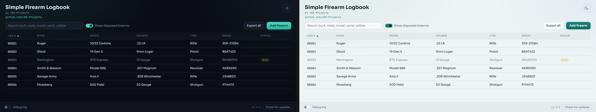

# Simple Firearm Logbook
A private, offline logbook for your personal firearm collection: records, photos, dispositions, and exports.
Built by [JDE-Projects](https://github.com/JDE-Projects).

If you enjoyed this project and would like to buy me a coffee, check out my [Ko-fi](https://ko-fi.com/jdeprojects).

## Preview
<p align="center">
  
  <br><em>Dark and light themes</em>
</p>

## Highlights
- Permanent log numbers that are never reused, even after a firearm is deleted.
- Photo attachments for each firearm, with a starred primary photo used in lists and exports.
- Disposition tracking (sold, traded, lost, stolen) that keeps the record instead of deleting it.
- Single-firearm HTML export with embedded photos, ready to share or archive standalone.
- Full-collection zip export: an HTML report, a CSV of every field, and the original photos.
- Print-friendly export layout, independent of the app's own theme.
- Fully offline: your collection data never leaves the machine.

## How it works
- Backend: Python with SQLite (standard library). Data is stored in `simple_firearm_logbook.db` next to the exe, with photos copied into a `photos\` folder alongside it.
- Window: pywebview on the Qt backend, UI in simple_firearm_logbook-UI.html.

## Download and run
Two ways to get it from the [Releases](../../releases) page, pick one:
- **Installer (recommended):** download `SimpleFirearmLogbook-vX.Y.Z-setup.exe` and
  run it. Installs the app, adds a Start menu shortcut, and can be removed later
  from Add or Remove Programs. Installs just for you by default (no admin); you can
  choose all users during setup.
- **Portable .zip:** download `SimpleFirearmLogbook-vX.Y.Z.zip`, extract it, and run
  `Simple Firearm Logbook.exe` from inside the extracted folder. No install, good for
  a locked-down PC or a USB stick. Keep the folder together.
Windows only, no Python or setup required. Unsigned, so SmartScreen may warn the
first time: More info > Run anyway.

## Updating

Simple Firearm Logbook doesn't update itself. The bottom bar has a **Check for updates** button that tells you when a newer release is out; when it does, get the new version from the [Releases](../../releases) page the same way you first installed it.

- **Installer:** download the new `SimpleFirearmLogbook-vX.Y.Z-setup.exe` and run it. It installs over your current copy and keeps your logbook database and photos.
- **Portable .zip:** download and extract the new `SimpleFirearmLogbook-vX.Y.Z.zip`. To keep your logbook database and photos, copy `simple_firearm_logbook.db`, the `photos\` folder, and the `.pref` file from the old folder into the new one.

Everything the app stores lives in the database and photos folder next to the exe, so there's nothing else to carry over.

## Verify this download (optional)
This release was built on GitHub from this public source, not on a personal
machine, and is signed with a build-provenance attestation. To confirm your
download is genuine, install the [GitHub CLI](https://cli.github.com) and run:
```
gh attestation verify SimpleFirearmLogbook-vX.Y.Z.zip \
  --repo JDE-Projects/Simple-Firearm-Logbook \
  --signer-repo JDE-Projects/Build-Tools
```
A `Verification succeeded!` line means the file was built by the published
pipeline from this repo. You can also check the file against the published
`.sha256`.

## Build from source (optional)
- Python 3 on PATH.
- `pip install -r requirements.txt` (pinned versions; includes PySide6 and pywebview)
  Keep `simple_firearm_logbook.py`, `simple_firearm_logbook-UI.html`, the `fonts/`
  folder, the `.ico`, `.png` and `-splash.png` together.
- Run from source: `python simple_firearm_logbook.py`
- Build the .exe: `Build_Simple_Firearm_Logbook.bat` -> `dist\Simple Firearm Logbook\`

## Using it
1. Add a firearm with its make, model, and whatever other details you know.
2. Add photos to it, and star one as the primary photo.
3. When a firearm leaves your collection, record a disposition (sold, traded, lost, or stolen) instead of deleting it.
4. Export a single firearm to HTML, or export the full collection to a zip with a report, CSV, and photos, for backup or your own records.

## Security and privacy
- Everything is stored locally next to the exe: the database and the photos folder.
- Nothing is sent anywhere.
- The only network call is the manual update check against GitHub releases.

## A note on how this was built
This project was built with AI assistance. The design decisions, feature
direction, and real-world testing were directed by me. The code was written
and revised with an AI assistant against that direction. Treat it like any
community tool: review and test it before relying on it.

## License
Released under the PolyForm Noncommercial 1.0.0 license. See LICENSE. If the tool bundles
third-party code, see THIRD-PARTY-LICENSES.txt.

For commercial licensing, open a [GitHub issue](https://github.com/JDE-Projects/Simple-Firearm-Logbook/issues) with the title "Commercial License Inquiry".
